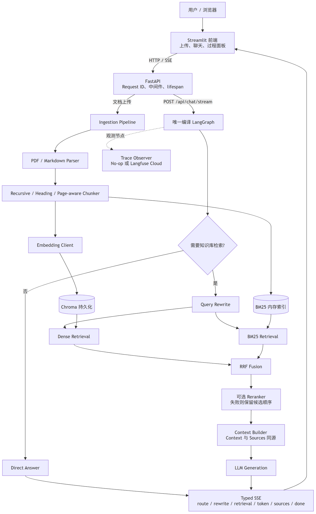
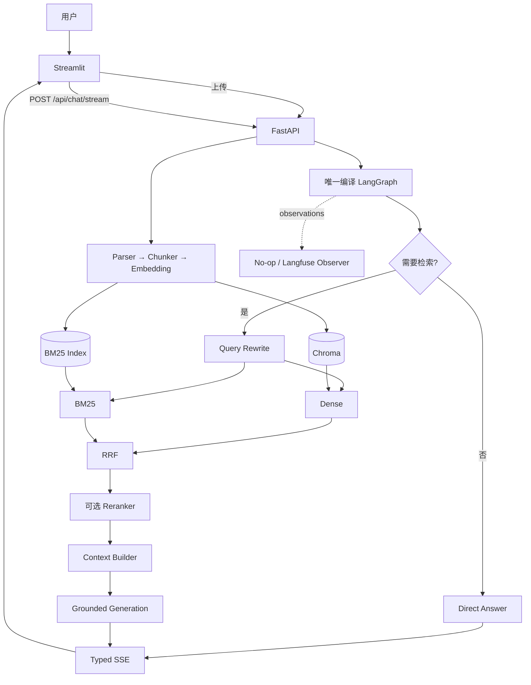

# Adaptive RAG

面向 PDF/Markdown 技术文档的自适应 RAG：用 LangGraph 只负责“直接回答或进入检索”的轻量路由，把主要工程能力放在结构化入库、Hybrid Retrieval、可降级 Rerank、精确 Sources、Evaluation 与可观测性上。

> 当前证据状态（2026-07-23）：正式 Evaluation 中 A/B/C 已真实执行，D 因当次未配置 Reranker 而跳过；真实 Reranker Smoke 与 Langfuse 导出仍为 **NOT RUN**。本仓库没有伪造截图、Trace 或重排收益。

## Demo 与证据

- 2–3 分钟录制稿：[docs/demo_script.md](docs/demo_script.md)
- 录制前检查：[docs/demo_checklist.md](docs/demo_checklist.md)
- 证据命名与脱敏：[docs/evidence/README.md](docs/evidence/README.md)
- 正式 Evaluation：[report.md](evaluation/reports/day7-task06-run/report.md) / [summary.json](evaluation/reports/day7-task06-run/summary.json)

**TODO（需要人工真实录制）：** Streamlit 截图/GIF/视频、真实 Langfuse Dashboard Trace。只有当 `/api/health` 和 SSE `done` 明确证明能力可用/已导出后，才可录制 Reranker 或 Trace 片段。

## 为什么这是 RAG 项目，而不是复杂 Agent

LangGraph 只有一条编译后的生产图，负责 Router、Query Rewrite、Retrieval 与 Generation 的显式编排。它不包含工具自治循环、多 Agent、Web Search、长期记忆或权限系统。项目的核心是可测量的 RAG Pipeline：文档结构保留、Dense/BM25 召回、RRF 融合、二阶段排序、上下文与引用同源，以及可重复 Evaluation。

## 技术栈

| 层 | 实现 |
|---|---|
| API / Streaming | Python 3.11、FastAPI、Pydantic、SSE |
| Workflow | LangGraph（轻量 Router + RAG 编排） |
| Parsing / Chunking | PyMuPDF、自定义 Markdown Parser、Recursive / Heading / Page-aware Chunker |
| Retrieval | Chroma、Embedding API、jieba + rank_bm25、RRF、可选 HTTP Reranker |
| Generation | OpenAI-compatible LLM Client |
| Observability | Provider-neutral Observer、可选 Langfuse Cloud |
| UI / Deployment | Streamlit、Docker、Docker Compose |
| Quality | pytest、24 条人工证据标注 Evaluation、A/B/C/D Runner |

## 总体架构



可编辑源文件：[adaptive-rag-system-architecture.drawio](docs/assets/adaptive-rag-system-architecture.drawio)。



详细流程与 ID 生命周期见 [docs/architecture.md](docs/architecture.md)。

## 实际生产请求链路

浏览器请求不会经过第二套 runner：

```text
POST /api/chat/stream
  → lifespan-owned compiled LangGraph
  → route_query
      ├─ direct_answer
      └─ rewrite_query → retrieve/context → generate_answer
  → ChatStreamingService 仅映射图事件
  → route / rewrite / retrieval / token / sources / done
```

Provider 的原始 token delta 通过 LangGraph custom event 一对一传给 SSE。客户端断开时，ASGI disconnect 会取消待处理图事件、关闭异步 Provider iterator，并以 `cancelled` 终结 Trace 生命周期。

### 文档入库

```text
PDF / Markdown
  → 文件类型、大小与空内容校验
  → Parser 保留 page / heading_path
  → Chunker 生成稳定 chunk_id
  → 批量 Embedding
  → Chroma 持久化
  → BM25 原子重建
```

三种 Chunk 策略：

- `recursive`：段落 → 句子 → 字符回退，作为公平 Baseline；
- `markdown_heading`：限制在标题边界内合并，并保留 `section` / `heading_path`；
- `pdf_page_aware`：保留一基页码，避免引用丢失页面位置。

### Router、Rewrite 与 Hybrid Retrieval

Router 只回答“是否需要知识库”。检索分支先把上下文依赖问题改写为独立查询，再并行执行 Dense 与 BM25，最后用：

```text
RRF(d) = Σ 1 / (k + rank_i(d)), 默认 k = 60
```

融合不同评分尺度。Dense 或 BM25 单路失败时保留另一条路径；两路均失败时返回明确错误，不伪造空成功。

### Reranker、Context 与 Sources

Reranker 是可选二阶段排序：启用且可用时对 RRF candidates 重排；超时、HTTP 或响应错误时保留候选顺序并记录 degradation code。正式 Task 06 报告中的 D 组为 **SKIPPED**，因此当前没有真实 Rerank Gain 结论。

ContextBuilder 在同一步生成 `context`、`context_chunk_ids` 与 `context_sources`。SSE Sources 直接来自该映射，而不是从原始候选重新猜测，因此 `[S1]` 与页面/章节元数据保持一致。

### Observability 状态语义

| 字段 | 含义 |
|---|---|
| `enabled` | 用户是否打开该可选能力 |
| `configured` | 必需配置是否齐全 |
| `available` | 当前进程是否真正可使用 Provider |
| `trace_id` | Provider 真实创建的 Trace ID；No-op 时为空 |
| `trace_exported` | 终态 flush 成功后才为 `true` |

内部 `request_id` 每个 HTTP 请求唯一；客户端 `X-Request-ID` 只作为 `client_request_id` 回显，不用于资源索引。默认对问题/答案内容脱敏，并限制观测文本长度。真实 Langfuse Smoke 与 Dashboard 证据目前 **NOT RUN / TODO**。

## Evaluation

正式数据集 [dataset.jsonl](evaluation/dataset.jsonl) 包含 24 条人工证据标注问题、5 份真实知识文件、6 类问题，并为 Baseline/优化切分分别解析稳定 relevant chunk IDs。标签不是由检索 Top-K 反向生成。

指标：

- `Hit Rate@K`：Top-K 是否至少命中一个相关 Chunk；
- `Recall@K = |R_K ∩ G| / |G|`；
- `MRR`：首个相关结果排名倒数的宏平均；
- 关键词覆盖率：归一化后命中的唯一关键词比例；
- Average Latency：有效样本检索耗时均值；
- Rerank Gain：重排前首个相关排名减去重排后排名。

正式报告 `eval-20260722T204032Z`：

| 组 | Chunk | Retrieval | Rerank | 状态 | Hit@1 | Recall@1 | Recall@5 | MRR | 关键词覆盖率 | 延迟 ms |
|---|---|---|---|---|---:|---:|---:|---:|---:|---:|
| A | Recursive | Dense | No | COMPLETED | 0.9167 | 0.8056 | 1.0000 | 0.9583 | 0.4757 | 249.9190 |
| B | Source-optimized | Dense | No | COMPLETED | 0.8333 | 0.7014 | 0.9792 | 0.9167 | 0.4583 | 245.8679 |
| C | Source-optimized | Dense + BM25 + RRF | No | COMPLETED | 0.8333 | 0.7014 | 0.9792 | 0.9097 | 0.4549 | 385.3682 |
| D | Source-optimized | Dense + BM25 + RRF | Yes | SKIPPED | N/A | N/A | N/A | N/A | N/A | N/A |

三个可复核变化案例：

1. A→B：Hit@1 从 `0.9167` 降至 `0.8333`（约 `-0.0833`）；
2. A→B：Recall@1 从 `0.8056` 降至 `0.7014`（约 `-0.1042`）；
3. B→C：平均检索延迟从 `245.8679 ms` 升至 `385.3682 ms`（`+139.5003 ms`），MRR 同时从 `0.9167` 降至 `0.9097`。

结论仅适用于该 24 条项目内小数据集：当前结果没有证明结构化切分或 Hybrid 在此语料上带来收益，反而提示需要扩大语料、调参并分析失败样本。不得将它外推为生产普适结论。

复现：

```powershell
uv run --project backend python evaluation/run_eval.py --validate-only --all
# 会调用已配置的 Embedding/LLM；D 还要求真实 Reranker
uv run --project backend python evaluation/run_eval.py --all
```

## 配置

```powershell
Copy-Item .env.example .env
```

只在 `.env` 填写密钥，不要提交该文件。

| 能力 | 关键变量 | 默认状态 |
|---|---|---|
| Embedding | `EMBEDDING_BASE_URL/API_KEY/MODEL/DIMENSION` | 核心能力 |
| LLM | `LLM_BASE_URL/API_KEY/MODEL` | 核心能力 |
| Reranker | `RERANKER_ENABLED/BASE_URL/API_KEY/MODEL` | 关闭 |
| Hybrid | `HYBRID_RETRIEVAL_ENABLED`、Top-N、`RRF_K` | 开启 |
| Langfuse | `LANGFUSE_ENABLED/BASE_URL/PUBLIC_KEY/SECRET_KEY` | 关闭 |
| Storage | `CHROMA_PERSIST_DIR/CHROMA_COLLECTION` | 本地 Chroma |
| Frontend | `BACKEND_URL` | `http://127.0.0.1:8000` |

完整变量与安全默认值见 [.env.example](.env.example)。

## 本地运行

要求 Python 3.11+ 与 `uv`。

终端一：

```powershell
cd backend
uv sync --extra observability
uv run uvicorn src.main:app --host 0.0.0.0 --port 8000 --workers 1
```

终端二：

```powershell
cd frontend
uv sync
uv run streamlit run app.py --server.port 8501
```

访问 `http://127.0.0.1:8501`。`/api/live` 是基础存活；`/api/health` 是严格 readiness，并显示 Chroma、BM25、LLM、Embedding、Reranker 与 Tracing 状态。

## Docker 运行

```powershell
docker compose up --build -d --wait
docker compose ps
docker compose down
```

- Frontend：`http://127.0.0.1:8501`
- Backend health：`http://127.0.0.1:8000/api/health`
- Swagger：`http://127.0.0.1:8000/docs`

Chroma 写入 `./data`，内置知识文件从 `./knowledge` 只读挂载。后端固定单 Uvicorn worker，因为 BM25 内存索引与入库锁目前只保证单进程一致性。Compose 不启动自托管 Langfuse、Redis 或 Postgres。

一键冒烟：

```powershell
./scripts/docker-smoke.ps1
```

## 测试

本次 Task 08 最终验证命令：

```powershell
cd backend
uv run pytest -q

cd ../frontend
uv run pytest -q
```

最新真实结果将在 [docs/day7_acceptance_report.md](docs/day7_acceptance_report.md) 固化；外部测试默认跳过，必须显式 opt-in，不能把离线 Fake 测试写成真实 Provider 证据。

- Backend：`515 passed, 3 skipped`（3 项为显式 opt-in 外部 Smoke）；
- Frontend：`20 passed`。

## AnyKB 参考边界

参考仓库：[GU-Cryptography/anykb](https://github.com/GU-Cryptography/anykb)。本项目参考了 Parser 职责/最小清洗思想和递归切分的段落→句子→字符回退层级；Embedding、Ingestion、Chroma、Hybrid Retrieval、Reranker Adapter、LangGraph/SSE 与 Evaluation 均按本项目契约重新设计实现。没有迁入 AnyKB 的 Agent Tool Loop、多租户、用户/权限、会话记忆、Next.js、Web Search、Redis/Postgres 或管理后台。

仓库审查未发现直接复制的 AnyKB 源文件，但这不等于法律层面的逐行来源审计。上游 README 标注 MIT，当前仓库根目录未发现可核验 LICENSE 文件，因此在复制任何上游源码前必须执行 `LICENSE VERIFICATION REQUIRED`。详见 [NOTICE.md](NOTICE.md)。

## 项目目录

```text
backend/                 FastAPI、LangGraph、RAG 与测试
frontend/                Streamlit、API/SSE Client 与测试
knowledge/               内置 Markdown/PDF 技术语料
evaluation/              正式数据集、指标、Runner 与报告
docs/                    架构、验收、Demo、证据与求职材料
data/                    本地 Chroma（gitignored）
docker-compose.yml       单 worker 本地 Demo 编排
NOTICE.md                AnyKB 参考与许可证核验边界
```

## 已知限制

- 不支持 OCR、扫描 PDF、复杂表格/图片布局恢复；
- Chroma + 进程内 BM25 只适合单进程 Demo，不支持多 worker 一致性；
- Router、Rewrite 与答案生成依赖外部 LLM 稳定性；
- Reranker 与 Langfuse 只有 Adapter/离线契约，尚无真实 Smoke 证据；
- 24 条 Evaluation 规模较小，且当前优化组未优于 Baseline；
- 关键词覆盖率不能替代忠实度人工评审；
- Streamlit 不是生产级前端；没有认证、多租户、权限或限流；
- 当前仓库尚未提供项目自身 LICENSE，分发前需由维护者选择许可证。

## 后续优化

- 扩大并分层 Evaluation，调优 chunk size、Top-N、RRF k 与 Reranker；
- 在真实 Smoke 后补齐 D 组、Rerank Gain 与 Langfuse 脱敏证据；
- 增加引用完整率、无依据回答比例与人工忠实度评审；
- 引入 Parent-Child、Metadata Filter、Contextual Compression；
- 用持久化全文检索/向量数据库支持多进程部署；
- 增加 OCR、表格解析、认证、限流和后台任务队列。

## 求职与验收材料

- [简历描述](docs/resume_description.md)
- [一分钟讲解](docs/interview_1min.md)
- [三分钟讲解](docs/interview_3min.md)
- [面试问题](docs/interview_questions.md)
- [Day 7 最终验收](docs/day7_acceptance_report.md)

## License / Notice

第三方参考边界见 [NOTICE.md](NOTICE.md)。当前仓库没有项目自身 LICENSE；在公开分发或接受外部贡献前，应由项目维护者明确选择并提交许可证。
