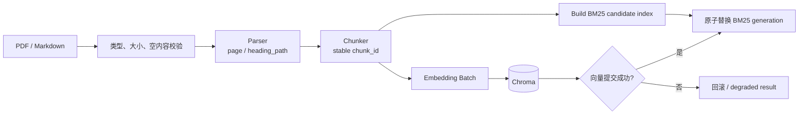
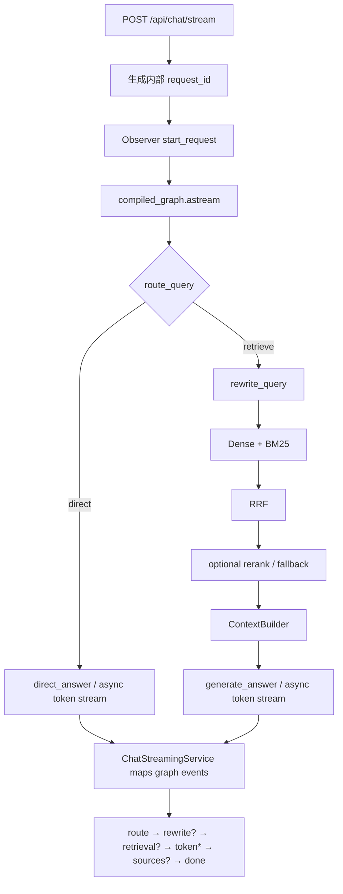
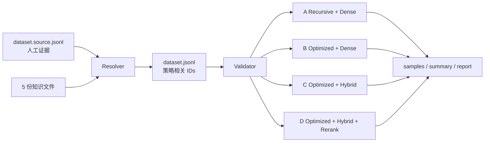
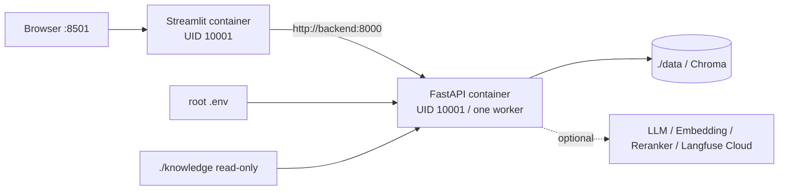
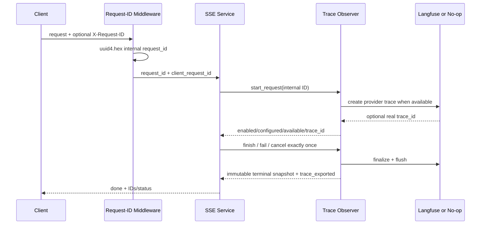

# Adaptive RAG Architecture

本文件描述当前生产代码，而不是规划中的未来架构。可编辑总图位于
[`assets/adaptive-rag-system-architecture.drawio`](assets/adaptive-rag-system-architecture.drawio)。

## 总体边界

系统由 Streamlit、FastAPI、单份 lifespan-owned LangGraph、RAG Runtime、Chroma、
进程内 BM25 和可选外部 Provider 组成。没有第二套浏览器 runner，也没有复杂
Agent Tool Loop。FastAPI lifespan 负责构造并关闭共享 LLM、Embedding、Chroma、
Observer 与 Workflow。

## 入库流程



上传 API 只在 Chroma 写入成功后发布新的 BM25 generation。启动时从持久化
Chroma 重建 BM25，因此 Compose 固定单 worker。

## 问答工作流与 SSE



`ChatStreamingService` 不再直接调用 Router、Rewrite、Retriever 或生成辅助函数。
它消费 `stream_mode=[custom,tasks,updates]`，把 custom token 原样映射为 SSE token，
并从图的最终 ContextBuilder state 发布 Sources。

断连路径：

```text
ASGI http.disconnect
  → 取消待处理 anext(service stream)
  → 取消 LangGraph async generation
  → provider iterator aclose/finally
  → Trace outcome=cancelled
  → Observer active state 释放
```

## Retrieval 与降级

Dense 和 BM25 独立召回，RRF 用排名而非原始分数融合。单路失败保留健康路径；
两路失败形成显式 fatal failure。Reranker disabled 时为 No-op；启用后若配置、网络
或响应失败，保留 RRF candidates 顺序并记录 `reranker_degraded` 与 degradation code。

ContextBuilder 对最终候选一次性生成：

- 有预算约束的 Context 文本；
- 与 Context 顺序一致的 `context_chunk_ids`；
- 引用 ID、source、page/section/heading_path 完整的 `context_sources`。

因此答案引用和 Sources 事件共享同一事实映射。

## Evaluation 运行流程



每组使用独立 Chroma collection 和 persist path。Runner 复用生产 Parser、Chunker、
Embedding、Chroma、Retrieval 与 BasicRAGService；缺少 Provider 时使用 SKIPPED 或
NOT_RUN，不写零分、不复制其他组结果。

## Deployment



Docker 使用 `/api/live` 判断进程存活，因此无外部凭据也能启动；`/api/health` 是
能力 readiness。Compose 的 `init: true` 与 stop grace period 使 SIGTERM 进入 FastAPI
lifespan shutdown，依次关闭 Client、flush/shutdown Observer、关闭 Runtime。

## Request ID / Trace ID 生命周期



- `request_id`：服务端生成、每 HTTP 请求唯一，是 Observer/Provider root 的唯一资源键；
- `client_request_id`：经格式校验的调用方关联字段，只回显、不索引资源；
- `trace_id`：只有 Provider 真正创建后才存在；
- `trace_exported`：终态 flush 成功后才为 true；
- terminal snapshot 放入容量 256、TTL 300 秒的 LRU 幂等缓存，不拥有 Provider 资源。

## Observability 状态矩阵

| enabled | configured | available | 解释 |
|---:|---:|---:|---|
| false | false | false | 能力关闭，No-op |
| true | false | false | 已打开但配置不完整 |
| true | true | false | 配置齐全但 SDK/Provider 当前不可用 |
| true | true | true | 可创建真实 Provider Trace |

即使 `available=true`，也只有终态 `trace_exported=true` 才代表本次导出确认成功。
